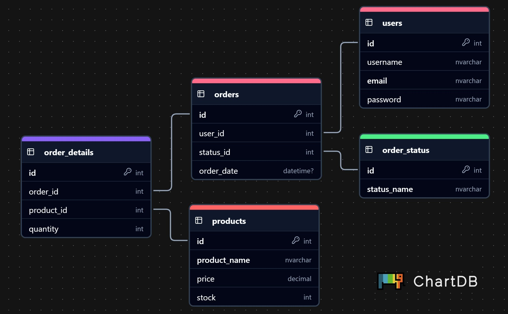

# Prueba Técnica - Ecommerce Grupo Zorro Abarrotero

Este es un proyecto de ecommerce que forma parte de la prueba técnica para Grupo Zorro Abarrotero. La aplicación permite a los usuarios registrarse, iniciar sesión, visualizar productos y gestionar sus pedidos.

<p><a target="_blank" href="https://youtu.be/ENUAd8J2krM">
    Abre este enlace para ver el video demostración
</a></p>

## Tecnologías Utilizadas

- **Frontend**: Angular 19, Angular Material (como Biblioteca de estilos y componentes)
- **Backend**: Sails.js (Node.js), Waterline (como ORM)
- **Base de Datos**: SQL Server Express
- **Autenticación**: Tokens JWT
- **Tecnologías**: HTML, CSS, JavaScript y TypeScript

## Requisitos Previos

1. **Instalar SQL Server Express** siguiendo los pasos de este [enlace](https://www.soti.net/soticonnect/v2024.1/en/setup/sqlserver/sqlserversetup.html).

## Instrucciones para Ejecutar el Proyecto

### 1. Configuración de la Base de Datos

- Ejecutar los scripts `SQLSchema.sql` y `SQLExampleData.sql` que se encuentran en la raíz del proyecto para crear la base de datos y cargar datos de ejemplo.

### 2. Configuración del Backend

- Navegar a la carpeta del backend:

  ```bash
  cd backend
  ```

- Instalar las dependencias necesarias:

  ```bash
  npm install
  ```

- Ejecutar el backend con el siguiente comando:

  ```bash
  sails lift
  ```

### 3. Configuración del Frontend

- Navegar a la carpeta del frontend:

  ```bash
  cd frontend
  ```

- Instalar las dependencias necesarias:

  ```bash
  npm install
  ```

- Ejecutar el frontend con el siguiente comando:

  ```bash
  ng serve
  ```

## Acceso a la Aplicación

Una vez que el backend y el frontend estén en ejecución, puedes acceder a la aplicación a través de tu navegador en la siguiente URL:

```
http://localhost:4200
```

## Notas

- Asegúrate de que SQL Server Express esté ejecutándose y que la conexión a la base de datos esté correctamente configurada en el archivo de configuración "datastores.js" de Sails.js.

- La aplicación es una Single Page Application (SPA) que utiliza Angular Material para el diseño de la interfaz.

## Diagrama entidad relación



## Guía de commits para Git

<ol>
  <li>La primera palabra debe ser (si no tiene ninguna, los cambios son para ambos proyectos):</li>
	<ul>
	    <li>front</li>
	    <li>back</li>
	</ul>
    <li>La segunda palabra debe ser:</li>
	<ul>
	    <li>feat (new function or feature)</li>
	    <li>fix (bug or error fix)</li>
	    <li>docs (documentation changes)</li>
	    <li>styles (changes that don't affect the code)</li>
	    <li>refactor (consists in rewrite code without changing the behavior)</li>
	    <li>perf (rewrite code to improves performance)</li>
	</ul>
    <li>Todo debe ser escrito en minúsculas</li>
    <li>Las palabras que se encuentras después de ":" corresponden a la descripción</li>
    <li>Se usa como separador un guión "-" para las primeras 2 palabras</li>
    <li>Todo debe estar escrito en inglés</li>
</ol>

Ejemplos:
<ul>
	<li>feat: initial projects structure</li>
	<li>back-refactor: get user function</li>
	<li>front-styles: responsive design</li>
</ul>

## Referencias

- [Building a Node.js Web API with Sails.js](https://blog.logrocket.com/building-a-node-js-web-api-with-sails-js/)
- [What I Learned on My Own: Sails.js - Implementing Middleware Authentication](https://dev.to/christopheek/what-i-learned-on-my-own-sailsjs-implementing-middleware-authentication-i16)
- [Implementing JWT Authentication Using Angular](https://raghuvardhankaranam.medium.com/implementing-jwt-authentication-using-angular-52bc82096b56)
- [Angular Authentication Using Route Guards](https://medium.com/@ryanchenkie_40935/angular-authentication-using-route-guards-bf7a4ca13ae3)